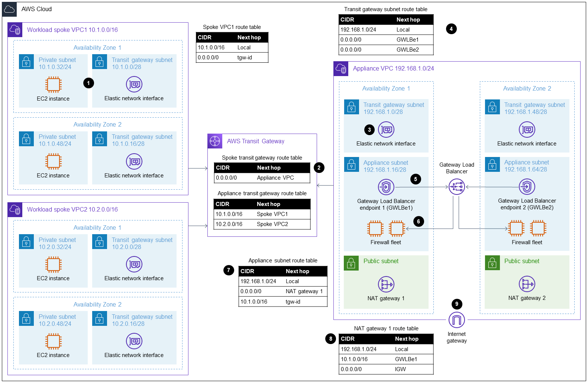
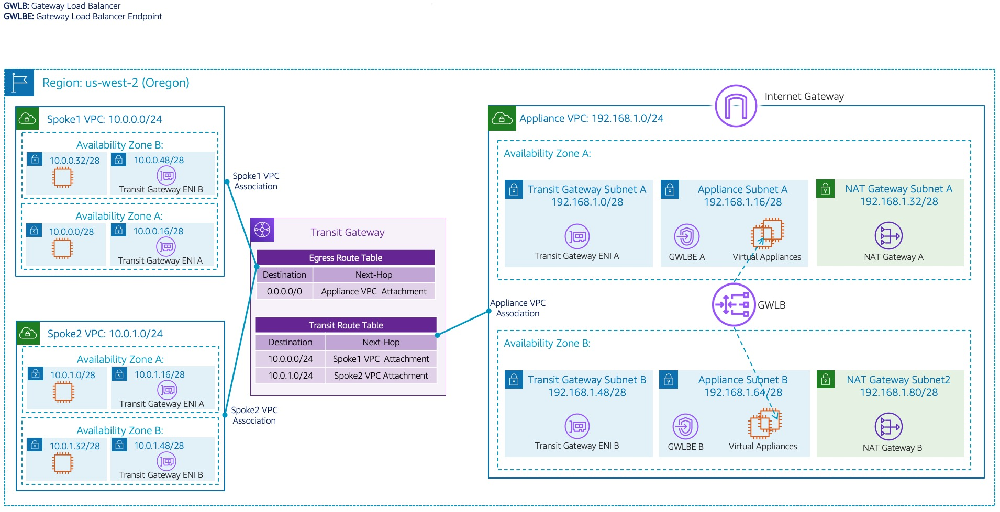

# Terraform AWS Inspection VPC

<em>Note: the following is purely for illustrative purposes</em>

<p align="center">
  
</p>

This repository manages the inspection vpc and rulesets within the AWS estate. The inspection VPC is seated at the heart of the estate, and leverages [AWS Network Firewall](https://aws.amazon.com/network-firewall/) as a managed solution. It's remit is

- To filter all traffic between networks and enviroments (i.e. production, development, ci).
- To filter all egress traffic from the spokes to the outbound internet.
- To provide the spokes with a central place to egress all traffic to the internet i.e. sharing NAT gateways.

## Rule Group Variables

A firewall policy in AWS Network firewall comprises of one of more references stateful / stateless [rule groups](https://docs.aws.amazon.com/network-firewall/latest/developerguide/rule-groups.html). The difference between these two groups is similar to NACL vs security groups in AWS; where SG's have knowlegde of direction and permit established connections to return traffic without the need of an additional rule. Note this module follows AWS recommendations, and has opted to ignore stateless rules completely, deferring purely to stateful Suricata rules.

[Rule groups](https://docs.aws.amazon.com/network-firewall/latest/developerguide/rule-groups.html) also have the ability to source in variables containing ipsets (a collection of CIDR block) or portsets (a collection of ports). These be referenced within the Suricata rules themselves, providing a reusable snippet i.e.

```shell
(in the tfvars)
policy_variables = {
  devops_net = ["10.128.0.0/24"]
  remote_net = ["10.230.0.0/24"]
}

# This will produce variables DEVOPS_NET and REMOTE_NET, and make
# them available in the ruleset

pass  tcp $REMOTE_NET any -> $HOME_NET
or
pass  tcp [!$REMOTE_NET, $DEVOPS_NET] any -> $HOME_NET
```

The module use the contents of the `var.firewall_rules` to source in the files and merge them together to produce the final ruleset.

## Egress Support

The inspection VPC can be configured to support egress traffic. This is useful when the inspection VPC is used as a central point for all egress traffic from the spokes. The egress support is enabled by setting the `var.enable_egress` to true. When enabled, the inspection VPC will have a route table that routes all traffic to the internet gateway. The route table is associated with the private subnets, and the internet gateway is attached to the VPC.

To enable egress support,

- `var.enable_egress` must be set to true.
- `var.publie_subnet_netmask` must be set to a non-zero value.

```hcl
## Provision a inspection firewall, but with an existing vpc
module "inspection" {
  source = "../.."

  availability_zones     = var.availability_zones
  firewall_rules         = local.firewall_rules
  name                   = var.name
  private_subnet_netmask = var.private_subnet_netmask
  public_subnet_netmask  = var.public_subnet_netmask
  ram_principals         = var.ram_principals
  tags                   = var.tags
  transit_gateway_id     = var.transit_gateway_id
}
```

## Event Logging

Currently the inspection VPC is setup to segregate the flow and alert logs into two CloudWatch log groups:

- Alerts: are directed to `${var.name}-alert-log`.
- Flows: are directed to `${var.name}-flow-log`.

This module also supports the ability to encrypt the logs using a KMS key. If the `var.create_kms_key` is set to true, a KMS key will be created and used to encrypt the logs. The key will be created in the same region as the logs.

## CloudWatch Dashboard

The module also supports the ability to deploy a CloudWatch dashboard to visualise the logs. The dashboard is created using a CloudFormation template, and is deployed into the same region as the logs. The dashboard is created using the `aws_cloudformation_stack` resource, and is created using the [assets/cloudfomation/nfw-cloudwatch-dashboard](assets/cloudfomation/nfw-cloudwatch-dashboard.yml) template.

## Reusing an Existing VPC

<p align="center">
  
</p>

The module supports the ability to reuse an existing VPC. This is useful when the inspection VPC is being deployed into an existing environment. The options defined depend on whether egress is enabled or not.

To reuse an existing VPC, **with egress support**

- `var.vpc_id` must be set to the ID of the VPC.
- `var.private_subnet_id_by_az` must be set to a map of availability zone to subnet id i.e `{ "eu-west-1a" = "subnet-12345678" }`.
- `var.public_route_table_ids` must be set to a list of public route table ids associated with the public subnets.
- `var.transit_route_table_by_az` must be set to a map of availability zone to transit route table id i.e `{ "eu-west-1a" = "rtb-12345678" }`.
- `var.transit_route_table_ids` must be set to a list of transit route table ids associated with the transit subnets.

```hcl
## Provision a inspection firewall, but with an existing vpc
module "inspection" {
  source = "../.."

  availability_zones        = var.availability_zones
  firewall_rules            = local.firewall_rules
  name                      = var.name
  private_subnet_id_by_az   = var.private_subnet_id_by_az
  public_route_table_ids    = var.public_route_table_ids
  ram_principals            = var.ram_principals
  tags                      = var.tags
  transit_gateway_id        = var.transit_gateway_id
  transit_route_table_by_az = var.transit_route_table_by_az
  transit_route_table_ids   = var.transit_route_table_ids
  vpc_id                    = var.vpc_id
}
```

To reuse an existing VPC, **without egress support**

- `var.vpc_id` must be set to the ID of the VPC.
- `var.private_subnet_id_by_az` must be set to a map of availability zone to subnet id i.e `{ "eu-west-1a" = "subnet-12345678" }`.
- `var.transit_route_table_by_az` must be set to a map of availability zone to transit route table id i.e `{ "eu-west-1a" = "rtb-12345678" }`.

```hcl
module "inspection" {
  source = "../.."

  availability_zones        = var.availability_zones
  create_kms_key            = false
  enable_dashboard          = var.enable_dashboard
  firewall_rules            = local.firewall_rules
  name                      = var.name
  private_subnet_id_by_az   = var.vpc.private_subnet_id_by_az
  ram_principals            = var.ram_principals
  tags                      = var.tags
  transit_gateway_id        = var.transit_gateway_id
  transit_route_table_by_az = var.vpc.transit_route_table_by_az
  vpc_id                    = var.vpc.vpc_id
}
```

## Pipeline Permissions

The following pipeline permissions are required to deploy the inspection VPC

```hcl
# tfsec:ignore:aws-iam-no-policy-wildcards
module "network_inspection_vpc_admin" {
  count   = var.repositories.firewall != null ? 1 : 0
  source  = "appvia/oidc/aws//modules/role"
  version = "1.2.0"

  name                = var.repositories.firewall.role_name
  common_provider     = var.scm_name
  description         = "Deployment role used to deploy the inspection vpc"
  permission_boundary = var.default_permissions_boundary_name
  repository          = var.repositories.firewall.url
  tags                = var.tags

  read_only_policy_arns = [
    "arn:aws:iam::aws:policy/AWSResourceAccessManagerReadOnlyAccess",
    "arn:aws:iam::aws:policy/ReadOnlyAccess",
  ]
  read_write_policy_arns = [
    "arn:aws:iam::aws:policy/AWSResourceAccessManagerFullAccess",
    "arn:aws:iam::aws:policy/AmazonEC2FullAccess",
    "arn:aws:iam::aws:policy/CloudFormationFullAccess", # Assuming you are deploying the dashboard
    "arn:aws:iam::aws:policy/LambdaFullAccess",
    "arn:aws:iam::aws:policy/ReadOnlyAccess",
    "arn:aws:iam::aws:policy/job-function/NetworkAdministrator",
  ]

  read_write_inline_policies = {
    "additional" = jsonencode({
      Version = "2012-10-17"
      Statement = [
        {
          Action = [
            "network-firewall:Associate*",
            "network-firewall:Create*",
            "network-firewall:Delete*",
            "network-firewall:Describe*",
            "network-firewall:Disassociate*",
            "network-firewall:List*",
            "network-firewall:Put*",
            "network-firewall:Tag*",
            "network-firewall:Untag*",
            "network-firewall:Update*",
          ]
          Effect   = "Allow"
          Resource = "*"
        },
        {
          Action   = ["iam:CreateServiceLinkedRole"],
          Effect   = "Allow",
          Resource = ["arn:aws:iam::*:role/aws-service-role/network-firewall.amazonaws.com/AWSServiceRoleForNetworkFirewall"]
        },
        {
          Action   = ["logs:*"],
          Effect   = "Allow",
          Resource = ["*"]
        }
      ]


      Version = "2012-10-17"
      Statement = [
        {
          Action = [
            "network-firewall:Describe*",
            "network-firewall:List*"
          ]
          Effect   = "Allow"
          Resource = "*"
        },
        {
          Action = [
            "logs:Get*",
            "logs:List*",
            "logs:Describe*",
          ],
          Effect   = "Allow",
          Resource = ["*"]
        }
      ]
    })
  }

  read_only_inline_policies = {
    "additional" = jsonencode({
      Version = "2012-10-17"
      Statement = [
        {
          Action = [
            "network-firewall:Describe*",
            "network-firewall:List*"
          ]
          Effect   = "Allow"
          Resource = "*"
        },
        {
          Action = [
            "logs:Describe*",
            "logs:Get*",
            "logs:List*",
          ],
          Effect   = "Allow",
          Resource = ["*"]
        }
      ]
    })
  }


```

<!-- BEGIN_TF_DOCS -->
## Requirements

| Name | Version |
|------|---------|
| <a name="requirement_terraform"></a> [terraform](#requirement\_terraform) | >= 1.0 |
| <a name="requirement_aws"></a> [aws](#requirement\_aws) | ~> 5.0 |

## Providers

| Name | Version |
|------|---------|
| <a name="provider_aws"></a> [aws](#provider\_aws) | ~> 5.0 |

## Modules

| Name | Source | Version |
|------|--------|---------|
| <a name="module_network_firewall"></a> [network\_firewall](#module\_network\_firewall) | aws-ia/networkfirewall/aws | 1.0.1 |
| <a name="module_vpc"></a> [vpc](#module\_vpc) | appvia/network/aws | 0.3.0 |

## Resources

| Name | Type |
|------|------|
| [aws_cloudformation_stack.dashboard](https://registry.terraform.io/providers/hashicorp/aws/latest/docs/resources/cloudformation_stack) | resource |
| [aws_cloudwatch_log_group.alert_log](https://registry.terraform.io/providers/hashicorp/aws/latest/docs/resources/cloudwatch_log_group) | resource |
| [aws_cloudwatch_log_group.flow_log](https://registry.terraform.io/providers/hashicorp/aws/latest/docs/resources/cloudwatch_log_group) | resource |
| [aws_ec2_managed_prefix_list.this](https://registry.terraform.io/providers/hashicorp/aws/latest/docs/resources/ec2_managed_prefix_list) | resource |
| [aws_kms_key.current](https://registry.terraform.io/providers/hashicorp/aws/latest/docs/resources/kms_key) | resource |
| [aws_networkfirewall_firewall_policy.this](https://registry.terraform.io/providers/hashicorp/aws/latest/docs/resources/networkfirewall_firewall_policy) | resource |
| [aws_networkfirewall_rule_group.stateful](https://registry.terraform.io/providers/hashicorp/aws/latest/docs/resources/networkfirewall_rule_group) | resource |
| [aws_ram_principal_association.this](https://registry.terraform.io/providers/hashicorp/aws/latest/docs/resources/ram_principal_association) | resource |
| [aws_ram_resource_association.this](https://registry.terraform.io/providers/hashicorp/aws/latest/docs/resources/ram_resource_association) | resource |
| [aws_ram_resource_share.this](https://registry.terraform.io/providers/hashicorp/aws/latest/docs/resources/ram_resource_share) | resource |
| [aws_s3_bucket.dashboard](https://registry.terraform.io/providers/hashicorp/aws/latest/docs/resources/s3_bucket) | resource |
| [aws_s3_bucket_acl.dashboard](https://registry.terraform.io/providers/hashicorp/aws/latest/docs/resources/s3_bucket_acl) | resource |
| [aws_s3_bucket_ownership_controls.dashboard](https://registry.terraform.io/providers/hashicorp/aws/latest/docs/resources/s3_bucket_ownership_controls) | resource |
| [aws_s3_bucket_policy.dashboard](https://registry.terraform.io/providers/hashicorp/aws/latest/docs/resources/s3_bucket_policy) | resource |
| [aws_s3_bucket_public_access_block.dashboard](https://registry.terraform.io/providers/hashicorp/aws/latest/docs/resources/s3_bucket_public_access_block) | resource |
| [aws_s3_bucket_server_side_encryption_configuration.dashboard](https://registry.terraform.io/providers/hashicorp/aws/latest/docs/resources/s3_bucket_server_side_encryption_configuration) | resource |
| [aws_s3_bucket_versioning.dashboard](https://registry.terraform.io/providers/hashicorp/aws/latest/docs/resources/s3_bucket_versioning) | resource |
| [aws_s3_object.dashboard](https://registry.terraform.io/providers/hashicorp/aws/latest/docs/resources/s3_object) | resource |
| [aws_caller_identity.current](https://registry.terraform.io/providers/hashicorp/aws/latest/docs/data-sources/caller_identity) | data source |
| [aws_iam_policy_document.dashboard](https://registry.terraform.io/providers/hashicorp/aws/latest/docs/data-sources/iam_policy_document) | data source |
| [aws_iam_policy_document.logging](https://registry.terraform.io/providers/hashicorp/aws/latest/docs/data-sources/iam_policy_document) | data source |
| [aws_kms_key.current](https://registry.terraform.io/providers/hashicorp/aws/latest/docs/data-sources/kms_key) | data source |
| [aws_region.current](https://registry.terraform.io/providers/hashicorp/aws/latest/docs/data-sources/region) | data source |

## Inputs

| Name | Description | Type | Default | Required |
|------|-------------|------|---------|:--------:|
| <a name="input_availability_zones"></a> [availability\_zones](#input\_availability\_zones) | Number of availability zones to deploy into | `number` | n/a | yes |
| <a name="input_name"></a> [name](#input\_name) | Name of the environment to deploy into | `string` | n/a | yes |
| <a name="input_tags"></a> [tags](#input\_tags) | Tags to apply to all resources | `map(string)` | n/a | yes |
| <a name="input_transit_gateway_id"></a> [transit\_gateway\_id](#input\_transit\_gateway\_id) | The ID of the Transit Gateway | `string` | n/a | yes |
| <a name="input_cloudwatch_kms"></a> [cloudwatch\_kms](#input\_cloudwatch\_kms) | Name of the KMS key to use for CloudWatch logs | `string` | `""` | no |
| <a name="input_cloudwatch_retention_in_days"></a> [cloudwatch\_retention\_in\_days](#input\_cloudwatch\_retention\_in\_days) | Number of days to retain CloudWatch logs | `number` | `30` | no |
| <a name="input_create_kms_key"></a> [create\_kms\_key](#input\_create\_kms\_key) | Create a KMS key for CloudWatch logs | `bool` | `false` | no |
| <a name="input_dashboard_bucket"></a> [dashboard\_bucket](#input\_dashboard\_bucket) | The name of the S3 bucket to store the CloudWatch Insights dashboard | `string` | `"lza-inspection-cw-dashboard"` | no |
| <a name="input_dashboard_key"></a> [dashboard\_key](#input\_dashboard\_key) | The name of the S3 bucket key to store the CloudWatch Insights dashboard | `string` | `"nfw-cloudwatch-dashboard.yml"` | no |
| <a name="input_enable_dashboard"></a> [enable\_dashboard](#input\_enable\_dashboard) | Indicates we should deploy the CloudWatch Insights dashboard | `bool` | `false` | no |
| <a name="input_enable_egress"></a> [enable\_egress](#input\_enable\_egress) | Indicates the inspectio vpc should have egress enabled | `bool` | `false` | no |
| <a name="input_enable_policy_change_protection"></a> [enable\_policy\_change\_protection](#input\_enable\_policy\_change\_protection) | Indicates the firewall policy should be protected from changes | `bool` | `false` | no |
| <a name="input_enable_subnet_change_protection"></a> [enable\_subnet\_change\_protection](#input\_enable\_subnet\_change\_protection) | Indicates the firewall subnets should be protected from changes | `bool` | `false` | no |
| <a name="input_external_rule_groups"></a> [external\_rule\_groups](#input\_external\_rule\_groups) | A collection of additional rule groups to add to the policy | <pre>list(object({<br>    priority = number<br>    arn      = string<br>  }))</pre> | `null` | no |
| <a name="input_firewall_rules"></a> [firewall\_rules](#input\_firewall\_rules) | A collection of firewall rules to add to the policy | <pre>list(object({<br>    name    = string<br>    content = string<br>  }))</pre> | `null` | no |
| <a name="input_ip_prefixes"></a> [ip\_prefixes](#input\_ip\_prefixes) | A collection of ip sets which can be referenced by the rules | <pre>map(object({<br>    name           = string<br>    address_family = string<br>    max_entries    = number<br>    description    = string<br>    entries = list(object({<br>      cidr        = string<br>      description = string<br>    }))<br>  }))</pre> | `{}` | no |
| <a name="input_network_cidr_blocks"></a> [network\_cidr\_blocks](#input\_network\_cidr\_blocks) | List of CIDR blocks defining the aws environment | `list(string)` | <pre>[<br>  "10.0.0.0/8",<br>  "192.168.0.0/24"<br>]</pre> | no |
| <a name="input_policy_variables"></a> [policy\_variables](#input\_policy\_variables) | A map of policy variables made available to the suricata rules | `map(list(string))` | `{}` | no |
| <a name="input_private_subnet_id_by_az"></a> [private\_subnet\_id\_by\_az](#input\_private\_subnet\_id\_by\_az) | If reusing an existing VPC, provider a map of az to subnet id | `map(string)` | `{}` | no |
| <a name="input_private_subnet_netmask"></a> [private\_subnet\_netmask](#input\_private\_subnet\_netmask) | Netmask for the private subnets | `number` | `24` | no |
| <a name="input_public_route_table_ids"></a> [public\_route\_table\_ids](#input\_public\_route\_table\_ids) | If reusing an existing VPC, provide the public route table ids | `list(string)` | `[]` | no |
| <a name="input_public_subnet_netmask"></a> [public\_subnet\_netmask](#input\_public\_subnet\_netmask) | Netmask for the public subnets | `number` | `0` | no |
| <a name="input_ram_principals"></a> [ram\_principals](#input\_ram\_principals) | A list of principals to share the firewall policy with | `map(string)` | `{}` | no |
| <a name="input_stateful_capacity"></a> [stateful\_capacity](#input\_stateful\_capacity) | The number of stateful rule groups to create | `number` | `5000` | no |
| <a name="input_transit_route_table_by_az"></a> [transit\_route\_table\_by\_az](#input\_transit\_route\_table\_by\_az) | If reusing an existing VPC, provider a map of az to subnet id | `map(string)` | `{}` | no |
| <a name="input_transit_route_table_ids"></a> [transit\_route\_table\_ids](#input\_transit\_route\_table\_ids) | If reusing an existing VPC, provide the transit route table ids | `list(string)` | `[]` | no |
| <a name="input_vpc_cidr"></a> [vpc\_cidr](#input\_vpc\_cidr) | CIDR block for the VPC | `string` | `"100.64.0.0/21"` | no |
| <a name="input_vpc_id"></a> [vpc\_id](#input\_vpc\_id) | If reusing an existing VPC, provide the VPC ID and private subnets ids | `string` | `""` | no |

## Outputs

| Name | Description |
|------|-------------|
| <a name="output_firewall_id"></a> [firewall\_id](#output\_firewall\_id) | The ARN of the firewall. |
| <a name="output_firewall_rule_groups"></a> [firewall\_rule\_groups](#output\_firewall\_rule\_groups) | The rule groups to associate with the firewall. |
| <a name="output_policy_variables"></a> [policy\_variables](#output\_policy\_variables) | The policy variables to associate with the firewall. |
| <a name="output_private_subnet_id_by_az"></a> [private\_subnet\_id\_by\_az](#output\_private\_subnet\_id\_by\_az) | The private subnet IDs by availability zone. |
| <a name="output_private_subnet_ids"></a> [private\_subnet\_ids](#output\_private\_subnet\_ids) | The IDs of the private subnets. |
| <a name="output_public_subnet_ids"></a> [public\_subnet\_ids](#output\_public\_subnet\_ids) | The IDs of the public subnets. |
| <a name="output_ram_principals"></a> [ram\_principals](#output\_ram\_principals) | The principals to share the firewall with. |
| <a name="output_routing_configuration"></a> [routing\_configuration](#output\_routing\_configuration) | The routing configuration for the firewall. |
| <a name="output_transit_attachment_id"></a> [transit\_attachment\_id](#output\_transit\_attachment\_id) | The ID of the transit gateway attachment. |
| <a name="output_transit_route_table_by_az"></a> [transit\_route\_table\_by\_az](#output\_transit\_route\_table\_by\_az) | The transit route table by availability zone. |
| <a name="output_transit_subnet_ids"></a> [transit\_subnet\_ids](#output\_transit\_subnet\_ids) | The IDs of the transit subnets. |
| <a name="output_vpc_id"></a> [vpc\_id](#output\_vpc\_id) | The ID of the VPC. |
<!-- END_TF_DOCS -->
